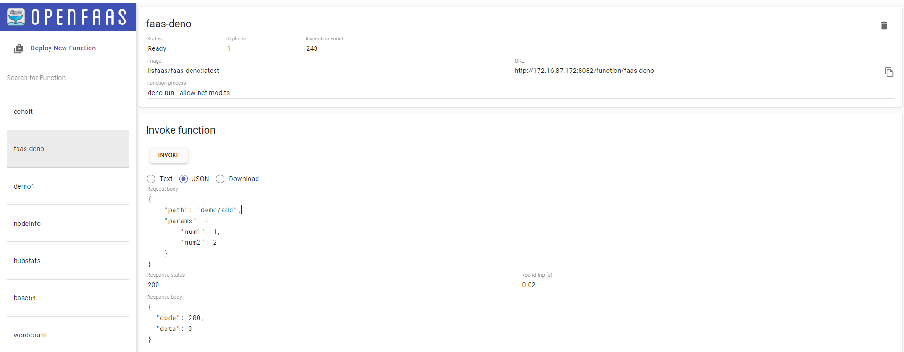

# openfaas-deno-template
a deno template for openfaas

## Get the template

```bash
faas-cli template store pull deno
```

## Example usage

The `function` folder already has a `demo.ts` as a reference.

### 1. Using the deno template

```bash
faas-cli new --lang deno your_function_name
```

### 2. Write your own function

create a ts file in `your_function_name` folder

```typescript
function fn1() {
  // ...
  return
}

function fn2() {
  // ...
  return
}

// export an object whose keys are function names and values are functions themselves.
export default {
  'fn1': fn1,
  'fn2': fn2
}

```

### 3. build and deploy your function

follow https://github.com/openfaas/workshop to build and deploy your function

### 4. test the function by Http reaquest or OpenFaaS-ui

1. request
    - method: `POST`
    - params: through `request body` in `JSON` format
      ```json
      {
        "path": "demo/add",
        "params": {
            "num1": 1,
            "num2": 2
        }
      }
      ```
      - path: the function path
      - params: the function params object
2. response
    ```json
    {
      "code": 200,
      "data": 3
    }
    ```
    |code|description|data|
    |-|-|-|
    |200|success|function return data|
    |401|error|specific error message thrown by function|
    |403|forbidden|"Invalid post body, please use JSON format."|
    |404|not found|"Function not found."|
  
  
